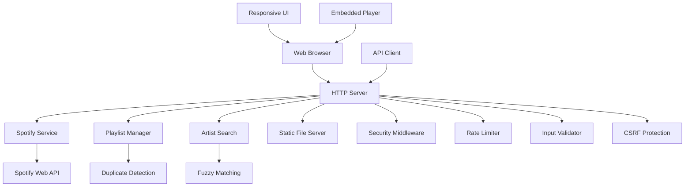

# Design Document

## Overview

go-listen is a web application built on the existing Go starter project scaffold that allows users to search for artists and automatically add their top 5 songs to designated "incoming" playlists on Spotify. The application provides both a responsive web interface and REST API for artist management, featuring fuzzy artist search, duplicate detection, playlist management, and comprehensive logging while following web security best practices. The application leverages the zmb3/spotify Go library for Spotify Web API integration and maintains the existing Cobra/Viper architecture while adding HTTP server capabilities.

## Architecture

### High-Level Architecture



### Component Layers

1. **Presentation Layer**
   - Responsive HTML/CSS/JS interface with mobile-first design
   - Searchable dropdown for playlist selection
   - Embedded Spotify player integration
   - REST API endpoints for programmatic access
   - Real-time feedback and confirmation messages

2. **Application Layer**
   - HTTP handlers and middleware
   - Request validation and sanitization
   - Rate limiting and security controls
   - CSRF protection for state-changing operations
   - Input validation against injection attacks

3. **Business Logic Layer**
   - Spotify service wrapper with top 5 track retrieval
   - Fuzzy artist search and matching
   - Playlist management for "Incoming" folder playlists
   - Duplicate detection with timestamp tracking
   - Override functionality for duplicate handling

4. **Integration Layer**
   - Spotify Web API client (zmb3/spotify) with Client Credentials flow
   - Configuration management (Viper)
   - Structured logging with multiple severity levels

## Components and Interfaces

### Web Server Component

```go
type Server struct {
    router     *http.ServeMux
    spotify    SpotifyService
    config     *config.Config
    logger     *logrus.Logger
    rateLimiter RateLimiter
}

type ServerConfig struct {
    Port         int
    StaticDir    string
    SpotifyConfig SpotifyConfig
    RateLimit    RateLimitConfig
}
```

### Spotify Service Interface

```go
type SpotifyService interface {
    SearchArtist(query string) (*Artist, error)
    GetArtistTopTracks(artistID string) ([]Track, error)
    GetUserPlaylists(folderName string) ([]Playlist, error)
    AddTracksToPlaylist(playlistID string, trackIDs []string) error
    CheckTracksInPlaylist(playlistID string, trackIDs []string) ([]bool, error)
}

type SpotifyClient struct {
    client *spotify.Client
    logger *logrus.Logger
}
```

### Artist Search Component

```go
type ArtistSearcher interface {
    FindBestMatch(query string) (*Artist, float64, error)
}

type FuzzyArtistSearcher struct {
    spotify SpotifyService
    logger  *logrus.Logger
}
```

### Playlist Manager Component

```go
type PlaylistManager interface {
    AddArtistToPlaylist(artistName, playlistID string, force bool) (*AddResult, error)
    GetIncomingPlaylists() ([]Playlist, error)
    GetTop5Tracks(artistID string) ([]Track, error)
    FilterPlaylistsBySearch(playlists []Playlist, searchTerm string) []Playlist
}

type PlaylistService struct {
    spotify   SpotifyService
    duplicate DuplicateDetector
    logger    *logrus.Logger
}
```

### Duplicate Detection Component

```go
type DuplicateDetector interface {
    CheckDuplicates(playlistID string, tracks []Track) (*DuplicateResult, error)
    CheckArtistInPlaylist(playlistID, artistID string) (*DuplicateResult, error)
}

type DuplicateResult struct {
    HasDuplicates   bool      `json:"has_duplicates"`
    DuplicateTracks []Track   `json:"duplicate_tracks"`
    LastAdded       time.Time `json:"last_added"`
    ArtistName      string    `json:"artist_name"`
    Message         string    `json:"message"`
}
```

## Data Models

### Core Models

```go
type Artist struct {
    ID       string `json:"id"`
    Name     string `json:"name"`
    URI      string `json:"uri"`
    Genres   []string `json:"genres"`
}

type Track struct {
    ID       string `json:"id"`
    Name     string `json:"name"`
    URI      string `json:"uri"`
    Artists  []Artist `json:"artists"`
    Duration int `json:"duration_ms"`
}

type Playlist struct {
    ID          string `json:"id"`
    Name        string `json:"name"`
    URI         string `json:"uri"`
    TrackCount  int    `json:"track_count"`
    EmbedURL    string `json:"embed_url"`
    IsIncoming  bool   `json:"is_incoming"`
}

type AddResult struct {
    Success       bool     `json:"success"`
    Artist        Artist   `json:"artist"`
    TracksAdded   []Track  `json:"tracks_added"`
    Playlist      Playlist `json:"playlist"`
    WasDuplicate  bool     `json:"was_duplicate"`
    Message       string   `json:"message"`
}
```

### API Request/Response Models

```go
type AddArtistRequest struct {
    ArtistName string `json:"artist_name" validate:"required,min=1,max=100"`
    PlaylistID string `json:"playlist_id" validate:"required"`
    Force      bool   `json:"force"`
}

type APIResponse struct {
    Success bool        `json:"success"`
    Data    interface{} `json:"data,omitempty"`
    Error   string      `json:"error,omitempty"`
}

type PlaylistSearchRequest struct {
    SearchTerm string `json:"search_term" validate:"max=100"`
}

type WebUIResponse struct {
    Success     bool        `json:"success"`
    Message     string      `json:"message"`
    Data        interface{} `json:"data,omitempty"`
    IsDuplicate bool        `json:"is_duplicate,omitempty"`
    LastAdded   *time.Time  `json:"last_added,omitempty"`
}
```

## Error Handling

### Error Types

```go
type AppError struct {
    Type    ErrorType `json:"type"`
    Message string    `json:"message"`
    Code    int       `json:"code"`
    Cause   error     `json:"-"`
}

type ErrorType string

const (
    ErrorTypeValidation ErrorType = "validation"
    ErrorTypeSpotify   ErrorType = "spotify"
    ErrorTypeNotFound  ErrorType = "not_found"
    ErrorTypeRateLimit ErrorType = "rate_limit"
    ErrorTypeInternal  ErrorType = "internal"
)
```

### Error Handling Strategy

1. **Input Validation Errors**: Return 400 Bad Request with validation details
2. **Spotify API Errors**: Map to appropriate HTTP status codes (401, 403, 429, 500)
3. **Not Found Errors**: Return 404 with helpful error messages
4. **Rate Limit Errors**: Return 429 with retry-after header
5. **Internal Errors**: Return 500 with generic message, log full details

## Testing Strategy

### Unit Testing

1. **Service Layer Tests**
   - Mock Spotify API responses
   - Test fuzzy matching algorithms
   - Validate duplicate detection logic
   - Test error handling scenarios

2. **Handler Tests**
   - Test HTTP request/response handling
   - Validate input sanitization
   - Test rate limiting behavior
   - Test CSRF protection

3. **Integration Tests**
   - Test complete request flows
   - Validate Spotify API integration
   - Test database operations (if added later)

### Test Structure

```go
// Example test structure
func TestSpotifyService_SearchArtist(t *testing.T) {
    tests := []struct {
        name     string
        query    string
        mockResp *spotify.SearchResult
        mockErr  error
        want     *Artist
        wantErr  bool
    }{
        // test cases
    }
}
```

### Security Testing

1. **Input Validation Testing**
   - SQL injection attempts
   - XSS payload testing
   - Path traversal attempts
   - Oversized input handling
   - Artist name sanitization testing

2. **Rate Limiting Testing**
   - Burst request testing
   - Sustained load testing
   - IP-based limiting validation
   - API endpoint rate limiting

3. **CSRF Protection Testing**
   - Token validation for state-changing operations
   - Cross-origin request handling
   - Form submission protection

### Responsive Design Testing

1. **Mobile Device Testing**
   - Touch interface functionality
   - Viewport scaling and layout
   - Dropdown usability on small screens

2. **Cross-Device Testing**
   - Tablet layout adaptation
   - Desktop space utilization
   - Orientation change handling

## Implementation Details

### HTTP Server Setup

The application will extend the existing Cobra command structure with a new `serve` command that starts the HTTP server:

```go
var serveCmd = &cobra.Command{
    Use:   "serve",
    Short: "Start the web server",
    Run:   runServeCommand,
}

func runServeCommand(cmd *cobra.Command, args []string) {
    server := NewServer(conf)
    server.Start()
}
```

### Spotify Authentication

Since this is an internal service without user authentication requirements, we'll use Spotify's Client Credentials flow for app-only authentication:

1. Configure Spotify app credentials in environment variables
2. Obtain access token on startup for immediate service availability
3. Refresh token as needed automatically
4. Handle authentication errors gracefully without user intervention
5. No user authentication required for web interface or API access

### Web Interface Design

The responsive web interface will include:

1. **Main Search Interface**
   - Artist name input field with validation
   - Searchable dropdown for "Incoming" playlists
   - Add button with loading states
   - Override button for duplicate handling

2. **Embedded Player Section**
   - Dynamic Spotify embedded player
   - Updates based on selected playlist
   - Responsive sizing for different screen sizes

3. **Feedback and Status**
   - Success/error message display
   - Duplicate detection notifications with timestamps
   - Loading indicators for async operations

4. **Responsive Design Elements**
   - Mobile-first CSS with breakpoints
   - Touch-friendly interface elements
   - Adaptive layout for tablets and desktop
   - Orientation change handling

### Static File Serving

Static files (HTML, CSS, JS) will be embedded in the binary using Go's embed package:

```go
//go:embed static/*
var staticFiles embed.FS

func (s *Server) setupStaticRoutes() {
    staticHandler := http.FileServer(http.FS(staticFiles))
    s.router.Handle("/static/", staticHandler)
    s.router.HandleFunc("/", s.handleIndex)
}
```

### Rate Limiting Implementation

Implement token bucket rate limiting per IP address:

```go
type RateLimiter struct {
    visitors map[string]*rate.Limiter
    mu       sync.RWMutex
    rate     rate.Limit
    burst    int
}
```

### Logging Strategy

Comprehensive structured logging with different levels to meet requirement 6:
- INFO: Successful operations, artist additions, playlist selections
- WARN: Duplicate detections, rate limit hits, override usage
- ERROR: Spotify API errors, validation failures, search failures
- DEBUG: Detailed request/response information, fuzzy matching scores

Specific logging requirements:
- Log all artist search terms and matched results
- Log all song additions with playlist and track details
- Log API request details and responses
- Log security events and suspicious activity
- Include timestamps and request correlation IDs

### Configuration Management

Extend existing Viper configuration with web server settings:

```go
type Config struct {
    // Existing fields
    Username string
    
    // New web server fields
    Server ServerConfig
    Spotify SpotifyConfig
    Security SecurityConfig
}

type SpotifyConfig struct {
    ClientID     string
    ClientSecret string
    RedirectURL  string
}
```

### Key Design Decisions and Rationales

1. **No User Authentication**: Based on requirement 9, the application is designed for internal network use without authentication complexity, using Spotify's Client Credentials flow for API access only.

2. **Responsive Design**: Requirement 7 mandates cross-device compatibility, so the design emphasizes mobile-first responsive design with adaptive layouts.

3. **Fuzzy Artist Matching**: To handle user input variations and improve search success rates, fuzzy matching is implemented rather than exact string matching.

4. **Duplicate Detection with Override**: Requirement 4 specifies both duplicate prevention and user control, so the design includes timestamp tracking and force override functionality.

5. **Top 5 Songs Limitation**: Based on requirement 1, the system specifically retrieves and adds the top 5 songs from each artist to maintain playlist quality and prevent overwhelming users.

6. **"Incoming" Folder Focus**: Requirement 2 specifies working with playlists from the "Incoming" folder, so the design includes folder-specific playlist filtering.

7. **Embedded Player Integration**: Requirement 3 mandates immediate playback capability, so the design includes Spotify embedded player integration with dynamic playlist updates.

8. **Comprehensive Security**: Requirement 8 drives the inclusion of CSRF protection, input validation, rate limiting, and sanitization throughout the application.

9. **Structured Logging**: Requirement 6 necessitates detailed operation tracking, so the design includes comprehensive logging with multiple severity levels and specific event tracking.

This design maintains compatibility with the existing Go starter project structure while adding all necessary components for the Spotify playlist management functionality as specified in the requirements.